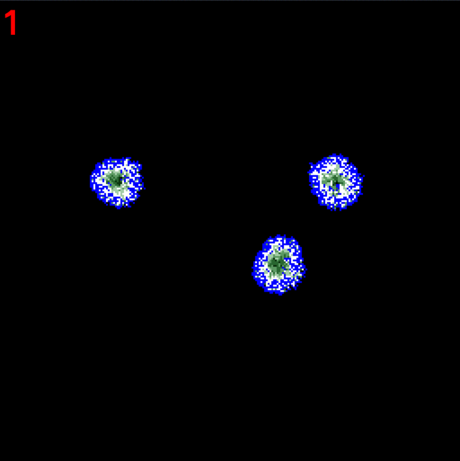

# cellular_automata
## The software of the simulation modeling by the cellular automata method: game of life, pseudo neural network, microorganisms. 

Microorganisms rules:
1. The cellular space forms the NxN cell field.
2. The neighborhood of the cell is eight neighboring cells.
3. Every cell has _energy_ _P_, which may be change from 0 to _Pmax_.
4. Until _P_ less _Pmax_, _P_ increases by _dP_.
5. The cell can contains only one microorganism.
6. At each step, the microorganism takes _dp_ energy from the cell which contains it.
7. The microogranism wastes _e_ energy at each step.
8. The life of each microorganism is equal to _L_ steps.
9. Since _T_ steps the microogranism undergoes division and moves to a new cell at each step. The new microogranism remains on the previous cell. 
 
Sample:

> 
